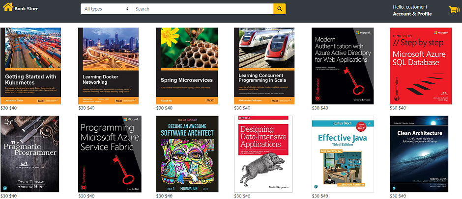

# Overview
This sample ecommerce application(sells only a few books:) for now, is built with Spring Boot 2.3.1(MVC on servlet stack). This application uses Azure Cosmos DB SQL API with "Spring Data Cosmos" client library(3.0.0).
The current version of the app showcases the following capabilities:
* @Query annotation for finder methods
* Collection configuration with annotations(Indexing, RUs)
* Multiple database and collections accessed from single application
* Auto generating UUID based IDs
* Spring Data Repository pattern 
* Enabling cosmos request diagnostics
* Directly using CosmosAsynClient from a spring application
* Infinite scroll with JQuery

I will add additional capabilities as time permits. Check out the project page associated with this repo for more details.

# Instructions

## First:
 * Java 8
 * Maven
 * Create a Cosmos DB SQL API Account. 
 * Clone the repo

## Then:
* Update the cosmos DB endpoint, key and locations information in application.properties
* mvn spring-boot:run from the project base
* On startup the application creates 2 databases and 4 collections between them.
* Access the WebApp at http://localhost/ebooks/index
* You will have to create user account to access the application functionality. The registration process asks for email ID, which will be used  as the login ID. Any email address is fine as long as it has a valid format. 
* If you prefer docker:  
  * mvn package 
  * docker build -t <YOUR REPO>/ebookstorespringbootmvc .
  * docker run -p 80:80 -e azure.cosmos.bookstore.uri=<COSMOS_ENDPOINT> -e azure.cosmos.bookstore.key=<COSMOS_KEY> -t <YOUR REPO>/ebookstorespringbootmvc
  * Access the WebApp at http://localhost/ebooks/index 
* If you want to just get the app up and running, you could use my container:
  * docker run -p 80:80 -e azure.cosmos.bookstore.uri=<COSMOS_ENDPOINT> -e azure.cosmos.bookstore.key=<COSMOS_KEY>  -t ravitella/ebookstorespringbootmvc
  * Access the WebApp at http://localhost/ebooks/index 
* You can access my live app at http://storecosmospringbootmvc.westus.azurecontainer.io/ebooks/index when available:)    
* This is the home page

 

